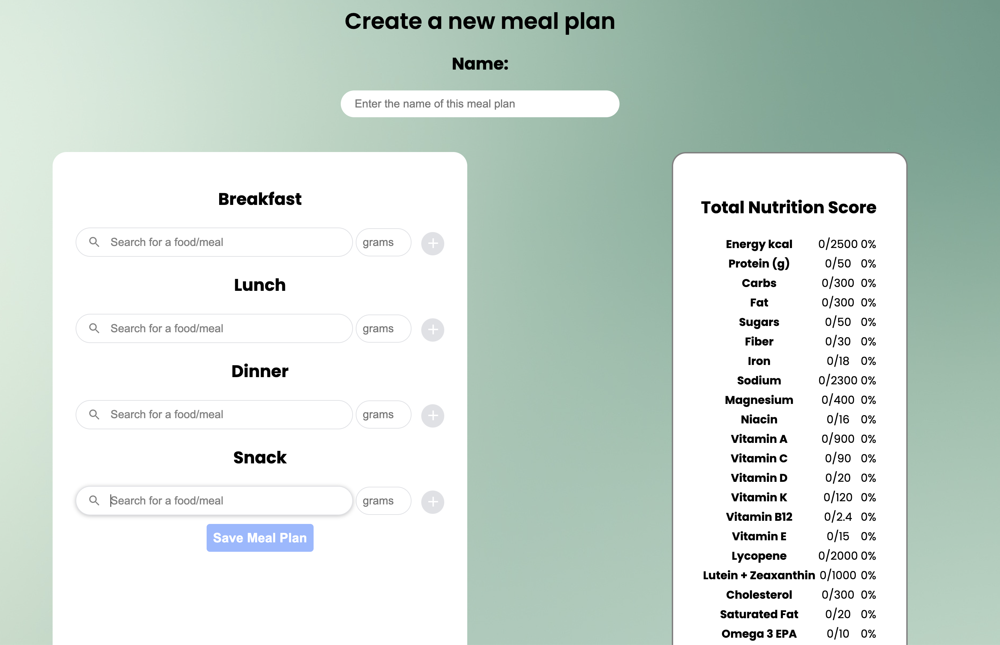

# Nutribook

# Description
Nutribook is a web app that allows you to create meal plans. It is special in that it helps you plan your meals to ensure they are nutritionally balanced and complete.

Many people struggle with planning their meals and ensuring they have the right nutrients. Most other apps only track macronutrients and not micronutrients. This could leave us susceptible to deficiencies that could lead to health issues.

# Technologies used
- React
- Node.js
- Express
- MongoDB
- CSS
- HTML

# Screenshots

# Launch the app
https://nutribook.onrender.com

# Planning
https://trello.com/b/tPCEdunU/nutribook

# Icebox items and next steps
- [ ] As a user I want to see graphics for the nutrition
- [ ] As a user I want to be able to add ingredients to make a meal
- [ ] As a user I want to be able to see disease specific nutritional targets to adjust

